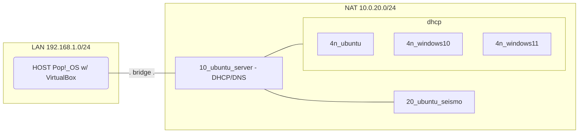

# Laboratorio Seísmo

## Lab en Virtualbox

- [docs/virtualbox_nat.md](/docs/virtualbox_nat.md): creación de red NAT en VirtualBox, instalación de máquinas virtuales, configuración de DHCP y DNS en `21_ubuntu`
<!-- - [docs/lab_seismo.md](/docs/lab_seismo.md): documentación de la administración de herramientas subyacentes a Seísmo (Suricata, Elastic Stack, etc.) en `10_ubuntu` -->

<!-- ## Componentes Seísmo

- [docs/og_seismo.md](/docs/og_seismo.md): info sobre el producto Seísmo de Trevenque, de cara a su correcta administración -->

<!-- - Elastic Stack
- netdiscover
- Suricata -->

