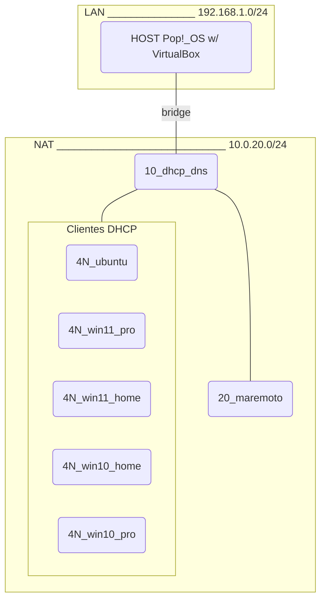

# Laboratorio MAREMOTO

- [Laboratorio MAREMOTO](#laboratorio-maremoto)
  - [Sobre SEISMO](#sobre-seismo)
  - [Lab MAREMOTO en Virtualbox](#lab-maremoto-en-virtualbox)

**Descripción**: Entorno virtualizado similar a SEISMO de Trevenque, con un servidor (`20_maremoto`) que analiza la red y posibles vulnerabilidades en los equipos conectados.

## Sobre SEISMO

- Documentación
  - [ ] [docs/seismo.md](#)
  - [ ] google drive
  - [ ] Notion
- Software importante
  - **ELK Stack**
  - **Suricata**

## Lab MAREMOTO en Virtualbox

> [docs/maremoto_lab.md](/docs/maremoto_lab.md): creación de red NAT en VirtualBox, instalación de máquinas virtuales, configuración de DHCP y DNS en `10_dhcp_dns`, despliegue del software importante en `20_maremoto`

- Máquinas virtuales:

| Máquina       | Sistema           | Descripción
| ---           | ---               | ---
| 10_dhcp_dns   | Ubuntu 22.04 LTS  | Servidor sin GUI para dar servicios DHCP y DNS en red NAT Dominio **maremoto.net** en subred 10.0.20.0/24
| 20_maremoto   | Ubuntu 22.04 LTS  | Servidor tipo SEISMO con: netdiscover, ELK Stack, Suricata
| 4N_win11_pro  | Windows 11 Pro    | Cliente windows para probar vulnerabilidades
| 4N_win11_home | Windows 11 Home   | Cliente windows para probar vulnerabilidades
| 4N_win10_home | Windows 10 Home   | Cliente windows para probar vulnerabilidades
| 4N_win10_pro  | Windows 10 Pro    | Cliente windows para probar vulnerabilidades
| 4N_ubuntu     | Ubuntu 22.04 LTS  | Cliente para probar el vulnerabilidades en Linux

- Topología de red:
  - NOTA: los servidores tienen IP fija 10.0.20.10 y 10.0.20.20, los clientes están en el rango DHCP 10.0.20.40-10.0.20.199

